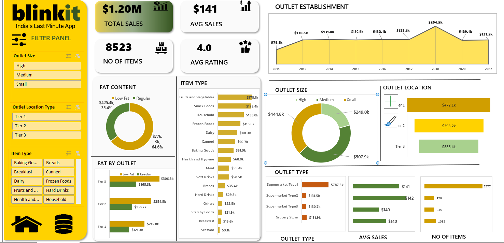

# Blinkit Grocery Sales Dashboard

## Project Overview
This project presents an interactive Excel dashboard developed to analyze Blinkit grocery sales performance. The dashboard provides insights into sales trends, outlet performance, product categories, fat content distribution, and customer ratings using Excel data visualization techniques.

## Dashboard Preview

## Features
- Interactive Dashboard with Slicers
- KPI Cards for Business Metrics
- Pivot Tables and Pivot Charts
- Sales Trend Analysis
- Outlet Performance Analysis
- Product Category Analysis
- Dynamic Filtering and Data Exploration

## Key Metrics
- Total Sales: $1.20M
- Average Sales: $141
- Number of Items: 8,523
- Average Rating: 4.0

## Files Included
- Blinkit_Grocery_Sales_DashBoard.xlsx
- Dashboard_Overview.png
- Dashboard_filtered_view.png
- Raw_Data.png

## Skills Demonstrated
- Microsoft Excel
- Data Cleaning
- Data Analysis
- Pivot Tables
- Pivot Charts
- Slicers
- Dashboard Design
- Business Intelligence

## Business Insights
- Analyzed sales distribution across outlet locations and outlet sizes.
- Identified top-performing product categories.
- Compared Low Fat and Regular product sales.
- Evaluated outlet establishment trends over time.

## Author
Dhana Lakshmi
